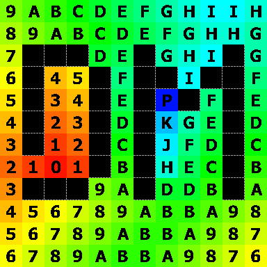
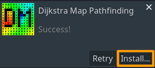

# Dijkstra Algorithm for Godot



## What it does

Howdy !

This is a GDNative project for Godot game engine, that introduces Dijkstra Map pathfinding node. It provides a much needed versatility currently absent from the build-in AStar pathfinding. Its main feature is the ability to populate the entire graph with shortest paths towards a given origin point. Total lengths of shortest paths and directions can then be easily looked up for any point in the graph.

Common use cases include: pre-computing pathfinding for tower-defense games, RTS games and roguelikes; listing available moves for turn-based games; aiding in movement-related AI behaviour. You can find more examples in [this amazing article](http://www.roguebasin.com/index.php?title=Dijkstra_Maps_Visualized).

The library is written in Rust programming language and performance should be comparable to C/C++ (approximately 10-20x faster than GDScript).

Note that the [API](./addons/dijkstra-map/doc/index.md) is now stable! Some features may be added over time.


## Installing

Note: when installing pre-compiled libraries, we support

- On linux: Ubuntu 20.04 or higher
- On macos: The latest macOS version (11 at the time of writing)
- On windows: Windows 10 or higher (presumably)

### Method 1: from the asset store (recommended)

This will work for linux x64, macos x86 and windows x64 for godot 3.5.1 (for another godot version you'll probably have to use the second method):
1. In the godot editor, go to the `AssetLib` tab

    

    And search for `Dijkstra Map Pathfinding`

2. Download and install the files

    
    

    This will install the files in `res://addons/dijkstra-map`.

### Method 2: from Github

**Note**: on linux x64, macos x86 or windows x64, you may skip steps 2-4 and use the pre-compiled libraries in `addons/dijkstra-map/Dijkstra_map_library/bin/<os-name>`. They may be slightly outdated though.

1. Clone this repository
2. Install the [Rust compiler](https://www.rust-lang.org/tools/install)
3. Install the dependencies for the [GDNative bindings for Rust](https://github.com/GodotNativeTools/godot-rust).
4. Run `cargo build --release`. This will build the library in `target/release` (for example, on windows: `target/release/dijkstra_map_gd.dll`).
    
	Note that this might take some time as it compiles all the dependencies for the first time.

    Copy the resulting library to `addons/dijkstra-map/Dijkstra_map_library/bin/<os-name>`.
5. Copy the `addons/dijkstra-map` directory into your project's `res://addons` directory.
6. Open Godot and add path to the binary file into the `res://addons/dijkstra-map/Dijkstra_map_library/dijkstra_map_library.tres` GDNativeLibrary resource. This resource tells Godot which binary to use for which system. For more info see the [GDNative C example in Godot's documentation](https://docs.godotengine.org/en/stable/tutorials/plugins/gdnative/gdnative-c-example.html).

## Examples

There are 3 examples scenes in the github repository:
* `addons/dijkstra-map/visualization demo/visualisation.tscn`

    Also available through the [asset store installation](#method-1-from-the-asset-store-recommended). Includes C# code, [mono-based Godot](https://docs.godotengine.org/en/3.5/tutorials/scripting/c_sharp/c_sharp_basics.html) is needed to run this example. 
* `Project_Example/project_example.tscn`
* `Project_Example/Turn based.tscn`

    The `knight` node contains exports variable that can be tweaked

And heavily commented code in `Project_Example/dependancy/`.

You can also look at the unit tests in `Tests/unit/*`.

## Features && How-To's

#### Basic Behaviour

In Godot project you start by creating a new DijkstraMap Node.
* First you need to specify the graph by adding points (vertices) and connections between them (edges). Unlike build-in AStar, DijkstraMap does not keep positions of the points (it only ever refers to them by their ID) and the costs of the connections need to be explicitly specified. It is user responsibility to keep track of points' position. You can do so manually with the `add_point` and `connect_points` methods or automatically with `add_*_grid` methods (`add_square_grid` or `add_hexagonal_grid` ...)

* Once you've done that, you can enable or disable any points you want from the pathfinding by passing its id to `enable_point` or `disable_point` (points are enabled by default).

* You then have to call `recalculate` method with appropriate arguments: by default you only have to pass an id or a PoolIntArray of ids of the origin point(s). The method will calculate shortest paths from that origin point(s) to every point in the graph.

* You can then access the information using various methods. Most notably `get_cost_map()` and `get_direction_map` which return a dictionary with keys being points' IDs and values being respective information about the length of the shortest path from that point or ID of the next point along the path.

* It is also possible to get a list of all points whose paths' lengths are within a given range, using the `get_all_points_with_cost_between()` method.

* You can get the full shortest path from a given point using `get_shortest_path_from_point` method. 

#### More recalculate flags

`recalculate` method has various optional arguments that modify its behavior. It is possible to:

* Switch intended direction of movement (useful when connections are not bidirectional).

* Set maximum allowed cost for paths and/or termination points, both of which terminate the algorithm early (useful to save CPU cycles).

* Set initial costs for the input points (useful to "weigh" the origin/destination points)

* Set weights for different terrain types.

Please, see the [documentation](./addons/dijkstra-map/doc/index.md) for full explanation.

#### The usefulness of terrain

Points in the DijkstraMap have an optional terrain ID parameter. This feature makes it possible to re-use the same DijkstraMap node for units with different movement restrictions, without having to duplicate the entire DijkstraMap and manually modify all connection costs.

For example, let's say you have 3 unit types in your game: Footsoldier (which moves the same speed regardless of terrain), Cavalry (which moves half the speed through forests) and Wagon (which can only move on roads). First you decide on integer IDs you will use for different terrain types, for example:
```
const TERRAIN_ID_OTHER=-1 #Note: default terrain ID -1 is hard-coded in the DijkstraMap
const TERRAIN_ID_ROAD=0
const TERRAIN_ID_FOREST=1
```
Now you assign these terrain IDs to the points in your DijkstraMap. This can be done while adding the points (`add_point` method has optional second parameter for terrain ID) or even after they were added (via `set_terrain_for_point` method). By default (if not specified otherwise), points get terrain ID of `-1`.

When recalculating the DijkstraMap for the Cavalry, we specify "terrain_weights" optional argument as follows:
```gdscript
my_dijkstra_map.recalculate(origin_point, {"terrain_weights": {TERRAIN_ID_FOREST:2.0} } )
```
Now, during this recalculation, connection costs of forest points are doubled* (ie. movement speed is halved) and the shortest paths will try avoid forest points, to minimize travel time. Specifically, path segments will only lead trough forests, if they are half the length of alternative paths. 

* *important note, if terrain_weights doesn't specify a terrain present in the dijkstra, this terrain will be inaccessible (cost = inf)
* *note: connection costs between two points are multiplied by the average of their respective weights. All terrain weights that remain unspecified in the argument have default terrain weight of `1.0`.

When recalculating the DijkstraMap for the Wagon, we specify "terrain weights" optional argument as follows:
```
my_dijkstra_map.recalculate(origin_point, {"terrain_weights": {TERRAIN_ID_FOREST:INF, TERRAIN_ID_OTHER:INF} } )
```
Now, during this recalculation, all points, except roads, are completely inaccessible, because their connections have infinite cost. The calculated paths will only follow roads.

## C# Support

A wrapper located in `addons/dijkstra-map/Dijkstra_map_library/DijkstraMap.cs` can be used to interface with the library. [Example use](#examples) can be seen in `addons/dijkstra-map/visualization demo/visualisation.tscn`. The benefits of this wrapper: 

* First-class development experience (same as GDScript).

    In GDScript you can do:
    ```GDScript
    dijkstramap = DijkstraMap.new()
    dijkstramap.add_square_grid(bmp)
    ```
    And then the same in C# with the DijkstraMap wrapper:
    ```C#
    _dijkstramap = new DijkstraMap();
    _dijkstramap.AddSquareGrid(bmp);
    ```

* Strongly typed inputs and outputs.

* NativeScript setup is already done. 

Make sure your C# code can find the `DijkstraMap.cs` file and its class.

## Notes

Careful ! If you pass arguments of the wrong signature to the Rust API, the game will not crash, if you're lucky and have a terminal open, it might print an error there but not in Godot! This issue can be avoided by using a gdscript wrapper
But it can lead to non trivial bugs, consider yourselves warned.
We're working on friendlier error at runtime.


## Running the tests

If you're familiar with the gut API, you can launch the Gut.tscn and run some test

You can also run 'cargo test' and you're free to look at rust test or contribute to them.

## Contributing

Open an issue before working on a feature, bugfix, unit tests, then we discuss it, then you can work on it (or let someone else) then do a pull request

Before doing that pull request, if you modified the rust code be sure you have build it "cargo build --release" and it still works! 
* the unit tests pass (cargo test and the gut scene)
* dragon.tscn is running
* the demo is running
* you have run cargo fmt and gdformat on your files 


## TODO

* if performance on dijkstra is a real heavy consideration, consider implementing threading 

## Use in projects

- [tacticalRPG](https://github.com/astrale-sharp/tacticalRPG) A in-development framework for creating a tactical rpg using Rust and possibly Godot. 

## Acknowledgments
KohuGaly
Astrale
Eäradrier
